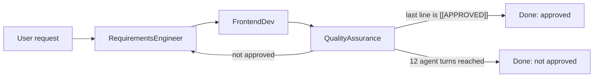

# AgentLab

Multi-agent experiments with [Microsoft Agent Framework](https://learn.microsoft.com/en-us/agent-framework/overview/) in .NET. A requirements agent, a frontend agent and a QA agent iterate in a group chat until QA approves the result. Runs against local models via [Ollama](https://ollama.com/).

## How it works

The user enters a request in the console. Three agents then take turns in a fixed round-robin order, and every agent sees the full conversation history before its turn.



| Agent | Responsibility |
|---|---|
| `RequirementsEngineer` | Turns the user request into requirements |
| `FrontendDev` | Implements a frontend solution based on the requirements |
| `QualityAssurance` | Reviews the result and either gives feedback or approves |

### Termination

The chat ends in exactly one of two ways:

1. **Approved.** The last non-empty line of a message from `QualityAssurance` is exactly `[[APPROVED]]`. Any `<think>...</think>` block that the model emits before its answer is ignored. The token must stand alone on its own line; text such as `not approved` or `APPROVED` inside a sentence does not end the chat.
2. **Iteration limit.** After 12 agent turns in total (4 full rounds with 3 agents) the chat stops without approval.

The console output states which of the two happened.

## Requirements

- .NET SDK matching the `TargetFramework` in `AgentLab.csproj`
- A running Ollama instance reachable over HTTP
- A model that follows instructions reliably. The project is configured for `qwen3:32b`.

Pull the model on the Ollama host:

```
ollama pull qwen3:32b
```

## Configuration

All configuration is currently set in code in `Program.cs`.

| Setting | Value | Where |
|---|---|---|
| Ollama endpoint | `http://192.168.50.3:11434/v1` | `Program.cs` |
| Model | `qwen3:32b` | `Program.cs` |
| Temperature | `0.3` | `Program.cs` (`ChatOptions`) |
| Max output tokens | `4096` | `Program.cs` (`ChatOptions`) |
| Max agent turns | `12` | `AgentFlow.cs` (`MaximumIterations`) |
| Agent instructions | per agent | `Personas` in the `AgentLab.Constants` namespace |

The endpoint uses Ollama's OpenAI-compatible API, so the path must end with `/v1`. Ollama does not validate the API key, but the client requires a non-empty value.

**Important:** The `QualityAssurance` persona must instruct the model to end an approving answer with `[[APPROVED]]` alone on the last line, and never to write that token in any other context. Without that instruction the chat can only end through the iteration limit.

## Running

```
dotnet run
```

Enter a request at the `## Me:` prompt. Agent responses are streamed to the console as they are generated.

## Project structure

| File | Purpose |
|---|---|
| `Program.cs` | Creates the `IChatClient` against Ollama and the shared `ChatOptions` |
| `AgentFlow.cs` | Creates the agents, builds the group chat workflow and streams the output |
| `ApprovalGroupChatManager.cs` | Round-robin manager with approval based termination |
| `Constants/Personas` | Instructions for each agent |

## Packages

| Package | Used for |
|---|---|
| `Microsoft.Agents.AI` | `AIAgent`, `ChatClientAgentOptions` |
| `Microsoft.Agents.AI.Workflows` | `AgentWorkflowBuilder`, `RoundRobinGroupChatManager`, workflow execution |
| `Microsoft.Extensions.AI.OpenAI` | `AsIChatClient()` on the OpenAI client, used against Ollama's OpenAI-compatible endpoint |

## Background

The project was originally built on Semantic Kernel (`AgentGroupChat` with a custom `TerminationStrategy`) and has been migrated to Microsoft Agent Framework, which Microsoft describes as the direct successor to Semantic Kernel and AutoGen.
